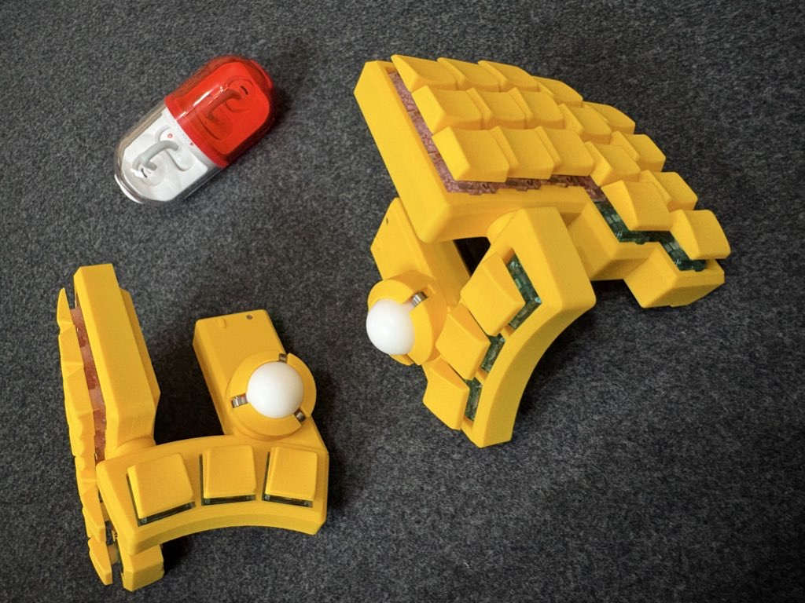
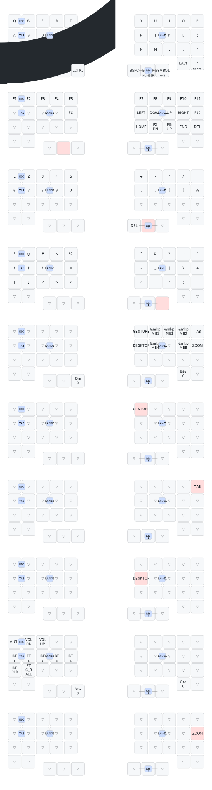

# KobitoKey_QWERTY



## Keymap



Combos: `Q+W` = ESC, `A+S` = TAB, `D+F` = 英数(LANG2), `J+K` = かな(LANG1), `BSPC+ENTER` = BT Layer

### Layer 0: DEFAULT (QWERTY)

```
┌──────┬──────┬──────┬──────────┬──────┐  ┌──────┬──────────┬──────┬──────┬──────────┐
│  Q   │  W   │  E   │    R     │  T   │  │  Y   │    U     │  I   │  O   │    P     │
├──────┼──────┼──────┼──────────┼──────┤  ├──────┼──────────┼──────┼──────┼──────────┤
│  A   │  S   │  D   │    F     │  G   │  │  H   │    J     │  K   │  L   │    ;     │
├──────┼──────┼──────┼──────────┼──────┤  ├──────┼──────────┼──────┼──────┼──────────┤
│  Z   │  X   │  C   │    V     │  B   │  │  N   │    M     │  ,   │  .   │    '     │
├──────┼──────┼──────┼──────────┼──────┤  ├──────┼──────────┼──────┼──────┼──────────┤
│LSHFT │ LALT │ LCMD │SPACE/L1  │LCTRL │  │ BSPC │ENTER/L2  │SYMBOL│ LALT │RSHFT+/  │
└──────┴──────┴──────┴──────────┴──────┘  └──────┴──────────┴──────┴──────┴──────────┘
```

※ SYMBOL: SYMBOLレイヤー専用キー（長押しで発動）。大文字入力には右端のRSHFT+/を使用。

### Layer 1: FUNCTION + NAV (SPACE hold)

```
┌──────┬──────┬──────┬──────┬──────┐  ┌──────┬──────┬──────┬──────┬──────┐
│  F1  │  F2  │  F3  │  F4  │  F5  │  │  F7  │  F8  │  F9  │ F10  │ F11  │
├──────┼──────┼──────┼──────┼──────┤  ├──────┼──────┼──────┼──────┼──────┤
│      │      │      │      │  F6  │  │  ←   │  ↓   │  ↑   │  →   │ F12  │
├──────┼──────┼──────┼──────┼──────┤  ├──────┼──────┼──────┼──────┼──────┤
│      │      │      │      │      │  │ HOME │ PGDN │ PGUP │ END  │ DEL  │
├──────┼──────┼──────┼──────┼──────┤  ├──────┼──────┼──────┼──────┼──────┤
│      │      │      │ ▓▓▓  │      │  │      │      │      │      │      │
└──────┴──────┴──────┴──────┴──────┘  └──────┴──────┴──────┴──────┴──────┘
```

### Layer 2: NUMBER (ENTER hold)

```
┌──────┬──────┬──────┬──────┬──────┐  ┌──────┬──────┬──────┬──────┬──────┐
│  1   │  2   │  3   │  4   │  5   │  │  +   │  -   │  *   │  /   │  =   │
├──────┼──────┼──────┼──────┼──────┤  ├──────┼──────┼──────┼──────┼──────┤
│  6   │  7   │  8   │  9   │  0   │  │  .   │  ,   │  (   │  )   │  %   │
├──────┼──────┼──────┼──────┼──────┤  ├──────┼──────┼──────┼──────┼──────┤
│      │      │      │      │      │  │      │      │      │      │      │
├──────┼──────┼──────┼──────┼──────┤  ├──────┼──────┼──────┼──────┼──────┤
│      │      │      │      │      │  │ DEL  │ ▓▓▓  │      │      │      │
└──────┴──────┴──────┴──────┴──────┘  └──────┴──────┴──────┴──────┴──────┘
```

### Layer 3: SYMBOL (RSHFT hold)

```
┌──────┬──────┬──────┬──────┬──────┐  ┌──────┬──────┬──────┬──────┬──────┐
│  !   │  @   │  #   │  $   │  %   │  │  ^   │  &   │  *   │  ~   │  `   │
├──────┼──────┼──────┼──────┼──────┤  ├──────┼──────┼──────┼──────┼──────┤
│  {   │  }   │  (   │  )   │  =   │  │  -   │  _   │  |   │  \   │  +   │
├──────┼──────┼──────┼──────┼──────┤  ├──────┼──────┼──────┼──────┼──────┤
│  [   │  ]   │  <   │  >   │  ?   │  │  /   │  "   │  :   │  ;   │  '   │
├──────┼──────┼──────┼──────┼──────┤  ├──────┼──────┼──────┼──────┼──────┤
│      │      │      │      │      │  │      │      │ ▓▓▓  │      │      │
└──────┴──────┴──────┴──────┴──────┘  └──────┴──────┴──────┴──────┴──────┘
```

### Layer 4: MOUSE (auto trackball)

```
┌──────┬──────┬──────┬──────┬──────┐  ┌──────┬──────┬──────┬──────┬──────┐
│ to0  │ to0  │ to0  │ to0  │ to0  │  │MO(5) │ MB1  │ MB3  │ MB2  │MO(6) │
├──────┼──────┼──────┼──────┼──────┤  ├──────┼──────┼──────┼──────┼──────┤
│ to0  │ to0  │ to0  │ to0  │ to0  │  │MO(7) │ MB4  │ to0  │ MB5  │ to0  │
├──────┼──────┼──────┼──────┼──────┤  ├──────┼──────┼──────┼──────┼──────┤
│ to0  │ to0  │ to0  │ to0  │ to0  │  │ to0  │ to0  │ to0  │ to0  │ to0  │
├──────┼──────┼──────┼──────┼──────┤  ├──────┼──────┼──────┼──────┼──────┤
│      │      │      │      │ to0  │  │      │      │      │ to0  │      │
└──────┴──────┴──────┴──────┴──────┘  └──────┴──────┴──────┴──────┴──────┘
```

### Layer 5: GESTURE (MO(5) + 左トラックボール)

右手でMO(5)キーを押しながら、左トラックボールを動かすとMacのジェスチャー操作を発動：

| トラックボール方向 | 動作             | キーコード |
| ------------------ | ---------------- | ---------- |
| ←                  | 左のSpaceへ移動  | Ctrl+Left  |
| →                  | 右のSpaceへ移動  | Ctrl+Right |
| ↑                  | Mission Control  | Ctrl+Up    |
| ↓                  | アプリウィンドウ | Ctrl+Down  |

MO(5)を押していない時は通常のスクロール動作。キーマップは全てtrans（透過）。

### Layer 6: TAB (MO(6) + 左トラックボール)

右手でMO(6)キーを押しながら、左トラックボールを動かすとブラウザのタブ操作を発動：

| トラックボール方向 | 動作         | キーコード     |
| ------------------ | ------------ | -------------- |
| →                  | 次のタブ     | Ctrl+Tab       |
| ←                  | 前のタブ     | Ctrl+Shift+Tab |
| ↑                  | 新規タブ     | Cmd+T          |
| ↓                  | タブを閉じる | Cmd+W          |

MO(6)を押していない時は通常のスクロール動作。キーマップは全てtrans（透過）。

### Layer 7: DESKTOP (MO(7) + 左トラックボール)

右手でMO(7)キーを押しながら、左トラックボールを動かすとデスクトップ操作を発動：

| トラックボール方向 | 動作 | キーコード |
|---|---|---|
| ↑ | Launchpad | F4 |
| ↓ | デスクトップを表示 | F11 |
| ← | Launchpad選択を左 / 左矢印 | Left |
| → | Launchpad選択を右 / 右矢印 | Right |

MO(7)を押していない時は通常のスクロール動作。キーマップは全てtrans（透過）。

### Layer 8: BT (BSPC+ENTER combo)

BSPC+ENTERの同時押しでBluetooth/ボリューム操作レイヤーに移動。`to 0`で戻る。

```
┌──────┬──────┬──────┬──────┬──────┐  ┌──────┬──────┬──────┬──────┬──────┐
│ MUTE │ VOL- │ VOL+ │      │      │  │      │      │      │      │      │
├──────┼──────┼──────┼──────┼──────┤  ├──────┼──────┼──────┼──────┼──────┤
│ BT0  │ BT1  │ BT2  │ BT3  │ BT4  │  │      │      │      │      │      │
├──────┼──────┼──────┼──────┼──────┤  ├──────┼──────┼──────┼──────┼──────┤
│BTCLR │CLRALL│      │      │      │  │      │      │      │      │      │
├──────┼──────┼──────┼──────┼──────┤  ├──────┼──────┼──────┼──────┼──────┤
│      │      │      │      │ to0  │  │      │      │      │ to0  │      │
└──────┴──────┴──────┴──────┴──────┘  └──────┴──────┴──────┴──────┴──────┘
```

## 設計方針

- プログラミング（Vim + Mac）向けに最適化
- Layer 0-3: 指で直接入力（文字→機能→数字→記号）
- Layer 4-7: トラックボール関連（マウス→ジェスチャー→タブ→デスクトップ）
- Layer 8: BT/ボリューム専用（BSPC+ENTERコンボで発動）
- BT操作はLayer 8に完全隔離して誤爆防止
- コンボでESC/TAB/英数/かなをLayer 0から直接入力可能
- 左トラックボール: スクロール + ジェスチャー（Layer 5/6/7時）
- 右トラックボール: マウスカーソル + Layer 4自動発動
- トラックボール操作感: **Magic Trackpad風**にチューニング（詳細は [docs/trackball-tuning.md](docs/trackball-tuning.md)、右は Phase 3 まで適用済み）
  - 右（ポインター）: CPI=700, min 0.62倍 / max 2.2倍 / 三次カーブ / threshold=2500, speed-max=10000 — macOS側の軌跡スライダーが真ん中付近で丁度よくなるよう調整
  - 左（スクロール）: min 0.8倍 / max 2.5倍 / 三次カーブ — 粘ってから伸びる慣性風の質感
  - ジェスチャー（Layer 5/6/7）: 用途の重さに応じて threshold/tick/wait-ms を段階設定（誤爆防止）
    - Layer 5 Spaces: threshold=4, tick=160, wait-ms=650
    - Layer 6 タブ: threshold=4, tick=160, wait-ms=650
    - Layer 7 デスクトップ: threshold=8, tick=200, wait-ms=800

## LED色

色番号: 0=消灯, 1=赤, 2=緑, 3=黄, 4=青, 5=マゼンタ(ピンク), 6=シアン(水色), 7=白

| Layer | 名前 | LED色 |
|---|---|---|
| 0 | DEFAULT | 消灯 |
| 1 | FUNCTION | 青 |
| 2 | NUMBER | 緑 |
| 3 | SYMBOL | 黄 |
| 4 | MOUSE | 白 |
| 5 | GESTURE | ピンク |
| 6 | TAB | ピンク |
| 7 | DESKTOP | ピンク |
| 8 | BT | 赤 |

## 評価

### 良い点

- **レイヤー構成が論理的** — 0-3は指で直接入力（文字→機能→数字→記号）、4-7はトラックボール関連（マウス→ジェスチャー→タブ→デスクトップ）、8はBT/ボリューム
- **3つのキーで3レイヤーにアクセス** — SPACE→L1, ENTER→L2, SYMBOL→L3
- **Layer 3(SYMBOL)でShift不要** — 全記号を1キーで直接入力可能
- **Layer 2(NUMBER)が計算特化** — 数字+四則演算+括弧で電卓的な使い方に最適
- **トラックボールジェスチャー3系統** — Spaces/MC、タブ操作、デスクトップ/Launchpadを使い分け（moNa 2方式）
- **BT/ボリュームをLayer 8に完全隔離** — BSPC+ENTERコンボでのみ発動、誤爆の心配なし
- **Layer 5/6/7にスタック防止策** — MO()自己参照で安定動作
- **LED色でレイヤーが一目瞭然** — FUNCTION=青、NUMBER=緑、SYMBOL=黄、MOUSE=白、ジェスチャー系=ピンク、BT=赤

### 改善候補

| 項目                       | 内容                                                        | 優先度 |
| -------------------------- | ----------------------------------------------------------- | ------ |
| Layer 1の左手2-3段目が空き | 10キー分。将来の拡張余地                                    | 低     |
| Layer 2とLayer 3の記号重複 | `+ - * / = ( ) %`が両方にある。意図的だが覚えるキーは増える | 低     |
| Layer 4の左手がto0のみ     | 左手全体がto0。将来マクロやショートカットを配置する余地あり  | 低     |
| ジェスチャー感度調整       | threshold/tickは実際の使用感で要チューニング                 | 中     |
| キースイッチの変更         | クリッキーからタクタイルやリニアへの変更を検討               | 低     |

## Tips

- キースイッチはクリッキーよりタクタイルやリニアの方がこのキーボードには向いているかも（個人的な意見）。

## キーマップの適用方法

### 1. ファームウェアのビルド

GitHubにpushすると、GitHub Actionsが自動でファームウェアをビルドします。

```bash
git add -A && git commit -m "キーマップ変更" && git push origin main
```

ビルドが始まらない場合は手動トリガー：

```bash
gh workflow run build.yml
```

### 2. ファームウェアのダウンロード

ビルド完了後、Artifactsから.uf2ファイルをダウンロード：

```bash
# 最新のビルドをダウンロード
gh run download -R s-hiraoku/KobitoKey_QWERTY -D ~/Downloads/KobitoKey_firmware
```

以下の3ファイルが取得できます：

- `KobitoKey_left...zmk.uf2` — 左手用
- `KobitoKey_right...zmk.uf2` — 右手用
- `settings_reset...zmk.uf2` — 設定リセット用（トラブル時）

### 3. キーボードへの書き込み

左右それぞれに対して：

1. USBケーブルで接続
2. **リセットボタンを2回素早く押す** → USBドライブとしてマウント
3. 対応する.uf2ファイルをドラッグ&ドロップ → 自動で再起動

### 4. Bluetoothの再ペアリング

書き込み後にBluetooth接続がうまくいかない場合：

1. 左右両方に`settings_reset...uf2`を書き込み（リセットボタン2回→ドラッグ&ドロップ）
2. 再度、左右それぞれの通常ファームウェアを書き込み
3. Mac側で「システム設定 → Bluetooth」から古いKobitoKeyを削除
4. 新しくペアリング

## 使用モジュール

| モジュール | 用途 | リポジトリ |
|---|---|---|
| zmk-pmw3610-driver | PMW3610トラックボールドライバ | https://github.com/badjeff/zmk-pmw3610-driver |
| zmk-feature-sensor_rotation | センサー回転補正 | https://github.com/hsgw/zmk-feature-sensor_rotation |
| zmk-rgbled-widget | RGB LEDウィジェット | https://github.com/caksoylar/zmk-rgbled-widget |
| zmk-input-processor-keybind | トラックボール→キー変換（ジェスチャー） | https://github.com/zettaface/zmk-input-processor-keybind |
| zmk-pointing-acceleration | トラックボール加速度 | https://github.com/oleksandrmaslov/zmk-pointing-acceleration |

## 参考

- https://note.com/11_50iii/n/n75cff4d3502c
- https://www.youtube.com/watch?v=1kVLyGr4CoI&t=2443s
